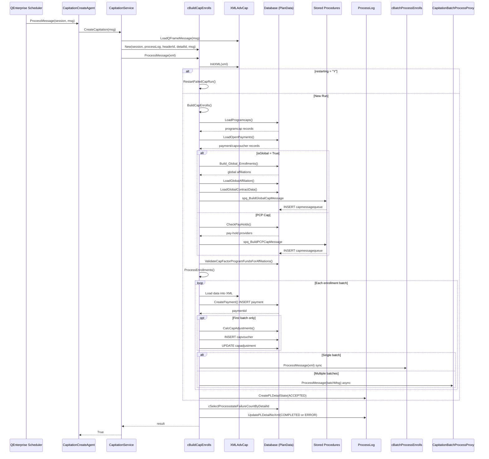
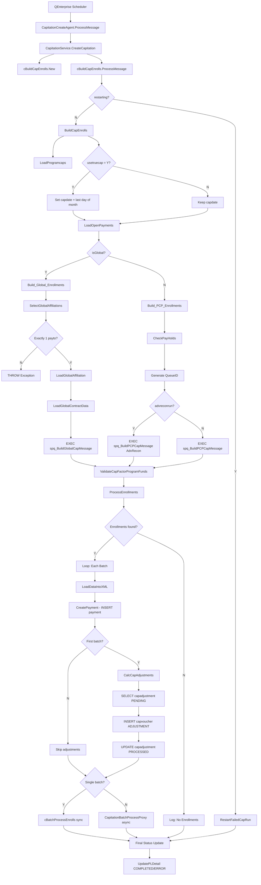

# CbuildCapEnroll End-to-End Code Analysis

## 1. Executive Summary

| Attribute | Value |
|---|---|
| **What cBuildCapEnrolls does** | Processes capitation enrollments for capitated providers — determines valid enrollments, builds cap messages per enrollment batch, creates payment records, calculates cap adjustments, and dispatches batches for downstream processing |
| **True process entry point** | `CapitationCreateAgent.ProcessMessage()` (QFrame Agent dispatched by QEnterprise message queue) |
| **Trigger type** | QFrame Agent — message-queue consumer invoked by the QEnterprise scheduler/dispatcher |
| **Main repository** | `mms-cms-cef` |
| **Main project/component** | `QCSI ASC Capitation` (VB.NET, under `components/QNXT/ASCs/Capitation/Src/`) |
| **Primary database** | PlanData alias (SQL Server), with secondary aliases `qenterprise` and `planintegration` |
| **Final process output** | `payment` records (INSERT), `capvoucher` records (INSERT), `capadjustment` records (UPDATE), `capmessagequeue` records (via stored procedures), and dispatched batch-processing messages to `CapitationBatchProcessProxy` |
| **Primary successful-path method count** | 18 distinct methods |
| **Total distinct method count (incl. error/retry)** | 25 distinct methods |

---

## 2. Exact Symbol Identification

| Search Term | Exact Match | Symbol Type | Repository | Project | File | Class/Interface | Lines |
|---|---|---|---|---|---|---|---|
| `cBuildCapEnrolls` | **YES** | Friend Class | mms-cms-cef | QCSI ASC Capitation | [cBuildCapEnrolls.vb](mms-cms-cef/components/QNXT/ASCs/Capitation/Src/QCSI%20ASC%20Capitation/cBuildCapEnrolls.vb#L32) | `Capitation.cBuildCapEnrolls` | 32–2079 |
| `BuildCapEnrolls` (C# Agent wrapper) | **YES** | Public Class | mms-cms-cef | BuildCapEnrolls | [BuildCapEnrolls.cs](mms-cms-cef/components/QNXT/Agents/Capitation/Src/BuildCapEnrolls/BuildCapEnrolls.cs#L16) | `Q.QFrame.Extensibility.CapitationAgents.BuildCapEnrolls` | 16–76 |
| `cBuildCapEnrolls` (newer wrapper) | **YES** | Public Class | mms-cms-cef | QCSI ASC Capitation | [BuildCapEnrolls.vb](mms-cms-cef/components/QNXT/ASCs/Capitation/Src/QCSI%20ASC%20Capitation/BuildCapEnrolls.vb#L20) | `Q.ServiceComponents.Capitation.cBuildCapEnrolls` | 20–185 |
| `IBuildCapEnrolls` | **NOT FOUND** | — | — | — | — | — | — |
| `ICapitationActivity` | **YES** | Interface | mms-cms-cef | QCSI ASC Capitation | [ICapitationActivity.vb](mms-cms-cef/components/QNXT/ASCs/Capitation/Src/QCSI%20ASC%20Capitation/ICapitationActivity.vb) | `Q.ServiceComponents.ICapitationActivity` | 10–85 |
| `ICapitationService` | **YES** | Interface | mms-cms-cef | QCSI ASC Capitation | [ICapitation.vb](mms-cms-cef/components/QNXT/ASCs/Capitation/Src/QCSI%20ASC%20Capitation/ICapitation.vb) | `Capitation.ICapitationService` | 10–18 |
| `CapitationActivity` | **YES** | Public Class | mms-cms-cef | QCSI ASC Capitation | [CapitationActivity.vb](mms-cms-cef/components/QNXT/ASCs/Capitation/Src/QCSI%20ASC%20Capitation/CapitationActivity.vb) | `Q.ServiceComponents.Capitation.CapitationActivity` | 22–192 |
| `CapitationService` | **YES** | Public Class | mms-cms-cef | QCSI ASC Capitation | [CapitationService.vb](mms-cms-cef/components/QNXT/ASCs/Capitation/Src/QCSI%20ASC%20Capitation/CapitationService.vb) | `Capitation.CapitationService` | 18–185 |
| `CapitationCreateAgent` | **YES** | Public Class | mms-cms-cef | QCSI ASC Capitation | [aCapitationAgents.vb](mms-cms-cef/components/QNXT/ASCs/Capitation/Src/QCSI%20ASC%20Capitation/aCapitationAgents.vb#L13) | `Agent.CapitationCreateAgent` | 13–56 |

**Two implementations exist:**

1. **Legacy path** (C# Agent → `CapitationActivity.BuildCapEnrolls()` → VB wrapper `cBuildCapEnrolls`): Uses the C# `BuildCapEnrolls` QFrame AddIn at [BuildCapEnrolls.cs](mms-cms-cef/components/QNXT/Agents/Capitation/Src/BuildCapEnrolls/BuildCapEnrolls.cs). This path instantiates `CapitationActivity` → `Q.ServiceComponents.Capitation.cBuildCapEnrolls` (the wrapper class in [BuildCapEnrolls.vb](mms-cms-cef/components/QNXT/ASCs/Capitation/Src/QCSI%20ASC%20Capitation/BuildCapEnrolls.vb)).

2. **Active path** (VB Agent → `CapitationService.CreateCapitation()` → `cBuildCapEnrolls`): Uses the VB.NET `CapitationCreateAgent` at [aCapitationAgents.vb](mms-cms-cef/components/QNXT/ASCs/Capitation/Src/QCSI%20ASC%20Capitation/aCapitationAgents.vb). This path instantiates `CapitationService` → `cBuildCapEnrolls` (the **Friend class** in [cBuildCapEnrolls.vb](mms-cms-cef/components/QNXT/ASCs/Capitation/Src/QCSI%20ASC%20Capitation/cBuildCapEnrolls.vb)).

The **active path** is the `CapitationCreateAgent → CapitationService → cBuildCapEnrolls` chain, which is the primary implementation containing all data access, business logic, and stored procedure calls.

---

## 3. True Entry Point

| Attribute | Value |
|---|---|
| **Repository** | mms-cms-cef |
| **Solution** | QCSI ASC Capitation |
| **Project** | QCSI ASC Capitation |
| **File** | [aCapitationAgents.vb](mms-cms-cef/components/QNXT/ASCs/Capitation/Src/QCSI%20ASC%20Capitation/aCapitationAgents.vb) |
| **Namespace** | `Agent` |
| **Class** | `CapitationCreateAgent` |
| **Method** | `Protected Overloads Overrides Function ProcessMessage(ByVal session As IQcsiSession, ByVal msg As String) As String` |
| **Lines** | 23–55 |
| **Trigger type** | QFrame Agent — message-queue consumer |
| **Trigger configuration** | QEnterprise agent registration (database-configured); agent dispatched via `CapProviderRequestMessageType` |
| **Input parameters** | `session` (IQcsiSession with DB connection info), `msg` (XML string — `CapProviderRequestMessageType`) |
| **First downstream call** | `CapitationService.CreateCapitation(msg)` |

**Restart entry point:** `CapitationRestartAgent.ProcessMessage()` (same file, line ~62–95) calls `CapitationService.RestartCapitation()`.

**Batch sub-entry point:** `CapitationBatchProcessAgent.ProcessMessage()` (same file, line ~100+) calls `CapitationService.BatchProcessEnrollments()`.

---

## 4. High-Level End-to-End Flow

```
1. QEnterprise Scheduler → dispatches CapProviderRequestMessageType message
2. CapitationCreateAgent.ProcessMessage()
3.   → CapitationService.CreateCapitation()
4.     → XMLAdvCap.LoadQFrameMessage()  (deserialize message)
5.     → cBuildCapEnrolls.New()  (constructor: initialize sessions for PlanData, qenterprise, planintegration)
6.     → cBuildCapEnrolls.ProcessMessage()
7.       → XMLAdvCap.InitXML()  (parse incoming XML)
8.       → [IF restarting="Y"] → RestartFailedCapRun()
9.       → [ELSE] → BuildCapEnrolls()
10.          → LoadProgramcaps()  → DB: cRetrieveProgramCapsByProgidCapTypeEffdateTermdate
11.          → [IF usetruecap="Y"] adjust capdate to last day of month
12.          → LoadOpenPayments()  → DB: cRetrievePaymentsByProgProvDateType
13.          → [IF isGlobal] → Build_Global_Enrollments()
14.             → cSelectGlobalAffiliationsByProgramidCapdateRecondateEtc
15.             → LoadGlobalAffiliation()  → DB: cSelectAffiliationByAffiliationid
16.             → LoadGlobalContractData()  → DB: cSelectGlobalContractData
17.             → cExecuteSpq_buildglobalcapmessage (SP: spq_BuildGlobalCapMessage)
18.          → [IF NOT isGlobal] → Build_PCP_Enrollments()
19.             → CheckPayHolds()  → DB: cRetrieveCapitationPayHoldsPlusCapType
20.             → CNextId.GetStringID()  (generate queue ID)
21.             → cExecuteSpq_buildpcpcapmessagewithtype (SP: spq_BuildPCPCapMessage)
22.          → ValidateCapFactorProgramFundsForAffiliations()
23.             → DB: cSelectContractinfoEtcByRequestidlistlistProgramidCapdateEtc
24.          → ProcessEnrollments()
25.             → LoadProgramcapsIntoXML()
26.             → LoadOpenPaymentsIntoXML()
27.             → LoadGlobalContractDataIntoXML()
28.             → LoadGlobalAffiliationIntoXML()
29.             → CreatePayment()  → DB: cInsertPaymentWithPaymentidProgramidProvidPaytypeEtc
30.             → CalcCapAdjustments()
31.                → DB: cSelectCapadjustmentEtcByProgramidAffiliateidCapdatePendingMonetaryReadonly
32.                → DB: cCreatecapvoucherRecord (INSERT capvoucher)
33.                → DB: cUpdateCapadjustmentByProcessdatePaymentidStatusEtc (UPDATE capadjustment)
34.             → [IF single batch] → cBatchProcessEnrolls.ProcessMessage() (synchronous)
35.             → [IF multiple batches] → CapitationBatchProcessProxy.ProcessMessage() (async via QFrame)
36.       → [FINALLY] UpdatePLDetail (process log finalization)
```

---

## 5. Complete Method Call Hierarchy

```
CapitationCreateAgent.ProcessMessage()                      [aCapitationAgents.vb:23]
  └─> CapitationService.CreateCapitation()                  [CapitationService.vb:62]
       └─> XMLAdvCap.LoadQFrameMessage()                    [XMLAdvCap.vb]
       └─> cBuildCapEnrolls.New()                           [cBuildCapEnrolls.vb:89]
       └─> cBuildCapEnrolls.ProcessMessage()                [cBuildCapEnrolls.vb:111]
            └─> XMLAdvCap.InitXML()                         [XMLAdvCap.vb]
            ├─[restarting=Y]─> RestartFailedCapRun()        [cBuildCapEnrolls.vb:1604]
            │    └─> cSelectRemainingCapmessagesByMessagequeueid
            │    └─> cCapPayment.ProcessMessage()
            │    └─> cBatchProcessEnrolls.ProcessMessage()  [cBatchProcessEnrolls.vb:68]
            │    └─> CapitationBatchProcessProxy.ProcessMessage()
            └─[restarting=N]─> BuildCapEnrolls()            [cBuildCapEnrolls.vb:203]
                 └─> LoadProgramcaps()                      [cBuildCapEnrolls.vb:996]
                 │    └─> cRetrieveProgramCapsByProgidCapTypeEffdateTermdate.LoadData()
                 └─> LoadOpenPayments()                     [cBuildCapEnrolls.vb:917]
                 │    └─> cRetrievePaymentsByProgProvDateType.LoadData()
                 ├─[isGlobal]─> Build_Global_Enrollments()  [cBuildCapEnrolls.vb:528]
                 │    └─> cSelectGlobalAffiliationsByProgramidCapdateRecondateEtc.LoadData()
                 │    └─> LoadGlobalAffiliation()           [cBuildCapEnrolls.vb:1522]
                 │    │    └─> cSelectAffiliationByAffiliationid.LoadData()
                 │    └─> LoadGlobalContractData()          [cBuildCapEnrolls.vb:1422]
                 │    │    └─> cSelectGlobalContractData.LoadData()
                 │    └─> cExecuteSpq_buildglobalcapmessage.LoadData()
                 ├─[NOT isGlobal]─> Build_PCP_Enrollments() [cBuildCapEnrolls.vb:396]
                 │    └─> CheckPayHolds()                   [cBuildCapEnrolls.vb:1327]
                 │    │    └─> cRetrieveCapitationPayHoldsPlusCapType.LoadData()
                 │    └─> CNextId.GetStringID()
                 │    └─> cExecuteSpq_buildpcpcapmessagewithtype.LoadData()
                 └─> ValidateCapFactorProgramFundsForAffiliations() [cBuildCapEnrolls.vb:302]
                 │    └─> cSelectContractinfoEtcByRequestidlistlistProgramidCapdateEtc.LoadData()
                 └─> ProcessEnrollments()                   [cBuildCapEnrolls.vb:729]
                      └─> LoadProgramcapsIntoXML()          [cBuildCapEnrolls.vb:1063]
                      └─> LoadOpenPaymentsIntoXML()         [cBuildCapEnrolls.vb:973]
                      └─> LoadGlobalContractDataIntoXML()   [cBuildCapEnrolls.vb:1489]
                      └─> LoadGlobalAffiliationIntoXML()    [cBuildCapEnrolls.vb:1573]
                      └─> CreatePayment()                   [cBuildCapEnrolls.vb:1264]
                      │    └─> CNextId.GetStringID()
                      │    └─> cInsertPaymentWithPaymentidProgramidProvidPaytypeEtc.ExecuteQuery()
                      └─> CalcCapAdjustments()              [cBuildCapEnrolls.vb:1967]
                      │    └─> cSelectCapadjustmentEtcByProgramidAffiliateidCapdatePendingMonetaryReadonly.LoadData()
                      │    └─> cCreatecapvoucherRecord.ExecuteQuery()
                      │    └─> cUpdateCapadjustmentByProcessdatePaymentidStatusEtc.ExecuteQuery()
                      └─> [small batch] cBatchProcessEnrolls.ProcessMessage()
                      └─> [large batch] CapitationBatchProcessProxy.ProcessMessage()
```

---

## 6. Detailed Method-by-Method Analysis

### Call 01: CapitationCreateAgent.ProcessMessage()

- **File:** [aCapitationAgents.vb](mms-cms-cef/components/QNXT/ASCs/Capitation/Src/QCSI%20ASC%20Capitation/aCapitationAgents.vb#L23)
- **Class:** `Agent.CapitationCreateAgent`
- **Signature:** `Protected Overloads Overrides Function ProcessMessage(ByVal session As IQcsiSession, ByVal msg As String) As String`
- **Purpose:** QFrame agent entry point. Deserializes the incoming `CapProviderRequestMessageType` message and delegates to `CapitationService.CreateCapitation()`.
- **Processing:** Creates a `CapProviderRequestMessageType` object from the message XML using `CUtility.GetObject()`, then instantiates `CapitationService` with session/headerId/detailId and calls `CreateCapitation`.
- **Exceptions:** Wraps all errors in `QFrameAgentException`.

### Call 02: CapitationService.CreateCapitation()

- **File:** [CapitationService.vb](mms-cms-cef/components/QNXT/ASCs/Capitation/Src/QCSI%20ASC%20Capitation/CapitationService.vb#L62)
- **Class:** `Capitation.CapitationService`
- **Signature:** `Public Function CreateCapitation(ByVal msg As String) As Boolean`
- **Purpose:** Orchestrates the creation of a new capitation run. Clones the session, initializes XML message parsing, creates the `cBuildCapEnrolls` instance, and calls `ProcessMessage`.
- **Processing:**
  1. Clones session
  2. Creates `XMLAdvCap` and loads QFrame message
  3. Creates `cBuildCapEnrolls(mySession, Me.ProcessLog, Me.HeaderId, Me.DetailId, msg)`
  4. Calls `ObjBuildCapEnrolls.ProcessMessage(ObjXmlMessage.XML)`
  5. Disposes the build object
- **Exceptions:** Catches `QServiceException` and generic `Exception`, logs via `LogErrorWithFallback`, throws `ActivityServiceComponentException`.

### Call 03: cBuildCapEnrolls.New() (Constructor)

- **File:** [cBuildCapEnrolls.vb](mms-cms-cef/components/QNXT/ASCs/Capitation/Src/QCSI%20ASC%20Capitation/cBuildCapEnrolls.vb#L89)
- **Purpose:** Initializes database sessions and stores process log references.
- **Processing:**
  1. Stores session reference, sets `Session.SelectAlias("PlanData")`
  2. Sets `QSession.SelectAlias("qenterprise")`
  3. Creates separate `sessionPlanintegration` session with alias `"planintegration"`
  4. Stores processLog, headerID, detailID, and original XML message

### Call 04: cBuildCapEnrolls.ProcessMessage()

- **File:** [cBuildCapEnrolls.vb](mms-cms-cef/components/QNXT/ASCs/Capitation/Src/QCSI%20ASC%20Capitation/cBuildCapEnrolls.vb#L111)
- **Signature:** `Public Function ProcessMessage(ByRef lxml As String) As Boolean`
- **Purpose:** Top-level control method. Parses XML, determines if this is a restart or new run, and dispatches accordingly.
- **Processing:**
  1. Creates `XMLAdvCap` and calls `InitXML(lxml)`
  2. Stores original XML
  3. Reads `loginfo` flag
  4. If `restarting = "Y"` → calls `RestartFailedCapRun()`
  5. Else → calls `BuildCapEnrolls()`
- **Finally block:** Queries `cSelectProcessstateFailureCountByDetailId` to check error count, then calls `UpdatePLDetailNoXml` with either ERROR or COMPLETED status.

### Call 05: BuildCapEnrolls() (Private)

- **File:** [cBuildCapEnrolls.vb](mms-cms-cef/components/QNXT/ASCs/Capitation/Src/QCSI%20ASC%20Capitation/cBuildCapEnrolls.vb#L203)
- **Purpose:** Main orchestration method for the enrollment-building process.
- **Processing:**
  1. Reads `optCAPBatchSize` from session options
  2. If summary + global → sets recondate = capdate (no recon for summary)
  3. Calls `LoadProgramcaps()` to retrieve program cap configuration
  4. Iterates programcaps: if `usetruecap = "Y"` and effective date range matches, sets `capdate` to last day of month
  5. Calls `LoadOpenPayments()` to get existing open/paid payments
  6. If `isGlobal = True` → calls `Build_Global_Enrollments()`
  7. Else → calls `Build_PCP_Enrollments()`
  8. Calls `ValidateCapFactorProgramFundsForAffiliations()`
  9. Calls `ProcessEnrollments()`

### Call 06: LoadProgramcaps()

- **File:** [cBuildCapEnrolls.vb](mms-cms-cef/components/QNXT/ASCs/Capitation/Src/QCSI%20ASC%20Capitation/cBuildCapEnrolls.vb#L996)
- **Purpose:** Loads `programcap` records for the program/capdate to determine cap method, split month, true cap settings.
- **DB Query:** `cRetrieveProgramCapsByProgidCapTypeEffdateTermdate` — SELECT from `programcap` WHERE programid, captype (M or S), effdate <= capdate, termdate >= recondate.

### Call 07: LoadOpenPayments()

- **File:** [cBuildCapEnrolls.vb](mms-cms-cef/components/QNXT/ASCs/Capitation/Src/QCSI%20ASC%20Capitation/cBuildCapEnrolls.vb#L917)
- **Purpose:** Retrieves existing open/paid cap payment records with associated capvoucher dates for reconciliation.
- **DB Query:** `cRetrievePaymentsByProgProvDateType` — SELECT from `payment` JOIN `capvoucher` WHERE programid, provid, capitationType, paydate range, status IN ('OPEN','PAID'), paytype = capitationType.

### Call 08: Build_PCP_Enrollments()

- **File:** [cBuildCapEnrolls.vb](mms-cms-cef/components/QNXT/ASCs/Capitation/Src/QCSI%20ASC%20Capitation/cBuildCapEnrolls.vb#L396)
- **Purpose:** Builds enrollment messages for PCP-based (non-global) capitation.
- **Processing:**
  1. Calculates first day of cap month
  2. Calls `CheckPayHolds()` — warns about providers on pay hold
  3. Generates a new `queueid` via `CNextId.GetStringID()`
  4. Determines management cap flag
  5. If advance recon run → queries `cSelectcapadjustmentReconDateforAdvanceReconRun` for recon date, then executes `cExecuteSpq_buildpcpcapmessagewithtypeadvreconrun`
  6. Else → executes `cExecuteSpq_buildpcpcapmessagewithtype` (calls stored proc `spq_BuildPCPCapMessage`)
- **Key stored procedure:** `spq_BuildPCPCapMessage` — populates `capmessagequeue` table with enrollment messages.

### Call 09: Build_Global_Enrollments()

- **File:** [cBuildCapEnrolls.vb](mms-cms-cef/components/QNXT/ASCs/Capitation/Src/QCSI%20ASC%20Capitation/cBuildCapEnrolls.vb#L528)
- **Purpose:** Builds enrollment messages for global (non-PCP) capitation.
- **Processing:**
  1. Queries `cSelectGlobalAffiliationsByProgramidCapdateRecondateEtc` to find global affiliations
  2. Must find exactly 1 global payto affiliation (else throws)
  3. Calls `LoadGlobalAffiliation()` → `cSelectAffiliationByAffiliationid` (must return exactly 1)
  4. Calls `LoadGlobalContractData()` → `cSelectGlobalContractData` (must find capitated contracts)
  5. Generates queueid
  6. Executes `cExecuteSpq_buildglobalcapmessage` (calls stored proc `spq_BuildGlobalCapMessage`)

### Call 10: ValidateCapFactorProgramFundsForAffiliations()

- **File:** [cBuildCapEnrolls.vb](mms-cms-cef/components/QNXT/ASCs/Capitation/Src/QCSI%20ASC%20Capitation/cBuildCapEnrolls.vb#L302)
- **Purpose:** Validates that fund definitions for capfactors are correctly configured. Logs warnings for invalid configurations.
- **DB Query:** `cSelectContractinfoEtcByRequestidlistlistProgramidCapdateEtc`

### Call 11: ProcessEnrollments()

- **File:** [cBuildCapEnrolls.vb](mms-cms-cef/components/QNXT/ASCs/Capitation/Src/QCSI%20ASC%20Capitation/cBuildCapEnrolls.vb#L729)
- **Purpose:** Iterates over enrollment batches, creates payment records, processes cap adjustments, and dispatches batch-processing messages.
- **Processing:**
  1. Groups enrollments by `capmessagequeueid`
  2. For each batch:
     - Loads programcaps, open payments, global contract data, and affiliations into XML
     - Calls `CreatePayment()` → INSERT into `payment` table
     - Calls `CalcCapAdjustments()` (first batch only)
     - If single batch → synchronous `cBatchProcessEnrolls.ProcessMessage()`
     - If multiple batches → creates `CapitationBatchProcessRequestMessageType` per sub-batch, dispatches via `CapitationBatchProcessProxy`

### Call 12: CreatePayment()

- **File:** [cBuildCapEnrolls.vb](mms-cms-cef/components/QNXT/ASCs/Capitation/Src/QCSI%20ASC%20Capitation/cBuildCapEnrolls.vb#L1264)
- **Purpose:** Creates a new payment record in the `payment` table.
- **DB Query:** `cInsertPaymentWithPaymentidProgramidProvidPaytypeEtc.ExecuteQuery()` — INSERT into `payment` table with paymentid, programid, provid, payee, paydate, paytype (capitationType), status='INCOMPLETE', capmessagequeueid, capmessage, eligibleorgid, headerid.

### Call 13: CalcCapAdjustments()

- **File:** [cBuildCapEnrolls.vb](mms-cms-cef/components/QNXT/ASCs/Capitation/Src/QCSI%20ASC%20Capitation/cBuildCapEnrolls.vb#L1967)
- **Purpose:** Processes pending monetary cap adjustments for the provider/program.
- **Processing:**
  1. Queries `cSelectCapadjustmentEtcByProgramidAffiliateidCapdatePendingMonetaryReadonly` (SELECT from `capadjustment` JOIN `program`)
  2. For each pending adjustment:
     - INSERT `capvoucher` record via `cCreatecapvoucherRecord.ExecuteQuery()` with captype='ADJUSTMENT'
     - UPDATE `capadjustment` record via `cUpdateCapadjustmentByProcessdatePaymentidStatusEtc.ExecuteQuery()` to status='PROCESSED'
  3. Sets `m_adjustCap = False` to prevent re-processing

### Call 14: CheckPayHolds()

- **File:** [cBuildCapEnrolls.vb](mms-cms-cef/components/QNXT/ASCs/Capitation/Src/QCSI%20ASC%20Capitation/cBuildCapEnrolls.vb#L1327)
- **Purpose:** Identifies PCPs on pay-hold and logs warnings.
- **DB Query:** `cRetrieveCapitationPayHoldsPlusCapType` — complex JOIN across `affiliation`, `contractinfo`, `contract`, `capitation`, `memberpcp`, `enrollkeys`, `benefitplan`, `affiliation` (provider), `provider`, `provmemo`, `memo` WHERE `memo.codeid = 'HOLD'`.

---

## 7. Business Rules

| # | Rule | Code Location | Condition | Plain-English | True Outcome | False Outcome |
|---|---|---|---|---|---|---|
| 1 | Summary + Global bypass recon | `BuildCapEnrolls()` L219-222 | `isSummary = True And isGlobal = True` | Summary global runs skip reconciliation | recondate and reviewdate set to capdate | Normal recon processing |
| 2 | True Cap date adjustment | `BuildCapEnrolls()` L233-243 | `programcaps.usetruecap = "Y"` and effective date range includes capdate | When true cap is configured, capdate moves to end of month to capture all enrollments | capdate = last day of month | capdate unchanged |
| 3 | Management cap type mapping | `LoadProgramcaps()` L1035 | `capitationType.Trim().ToUpper() = "MGT"` | Maps message cap type to DB captype code | `sProgramCapType = "M"` | `sProgramCapType = "S"` |
| 4 | Global vs PCP routing | `BuildCapEnrolls()` L251-255 | `isGlobal = True` | Determines enrollment loading strategy | `Build_Global_Enrollments()` | `Build_PCP_Enrollments()` |
| 5 | Single global payto required | `Build_Global_Enrollments()` L608 | `m_enrollments.RecordCount = 1` | Global cap requires exactly one payto affiliation | Proceeds with enrollment building | Throws exception |
| 6 | Global contract data required | `Build_Global_Enrollments()` L618 | `LoadGlobalContractData() = False` | Must find capitated contracts for global payto | Throws exception if no contracts found | Proceeds |
| 7 | Pay-hold warning | `CheckPayHolds()` L1390-1395 | `memo.codeid = 'HOLD'` on provider | Providers on hold are warned (still processed for enrollments, but flagged) | Warning logged to process log | No action |
| 8 | Advance recon run | `Build_PCP_Enrollments()` L463 | `advreconrun = "Y"` | Uses different stored proc with advance recon date | Executes `cExecuteSpq_buildpcpcapmessagewithtypeadvreconrun` | Executes `cExecuteSpq_buildpcpcapmessagewithtype` |
| 9 | Batch size splitting | `ProcessEnrollments()` L783 | `dtMsgQueue.Rows.Count` (from stored proc output) | Enrollments are split into batches per configured `optCAPBatchSize` | Multiple batches dispatched | Single batch synchronous |
| 10 | Adjustment processing | `CalcCapAdjustments()` L2018-2065 | `m_adjustments.RecordCount > 0` | Pending MONETARY adjustments for the provider/program are processed | Creates capvoucher and updates capadjustment to PROCESSED | No adjustment processing |
| 11 | Invalid fund validation | `ValidateCapFactorProgramFundsForAffiliations()` L330 | `fundid.Trim <> ""` | Invalid capfactor fund configurations generate warnings | Warning logged | No warning |
| 12 | Cap batch size option | `BuildCapEnrolls()` L211-213 | `Opt_CAPBatchSize > 0` | Application option controls enrollment batch sizing | `reqCAPSize` set from dictionary | No limit (0) |

---

## 8. Database Call Inventory

| # | Caller Method | Query ID | Query Class | Command Type | Operation | Tables | Purpose |
|---|---|---|---|---|---|---|---|
| 1 | `LoadProgramcaps()` | 10980 | `cRetrieveProgramCapsByProgidCapTypeEffdateTermdate` | SELECT | READ | `programcap` | Load program cap config (split month, true cap, cap method) |
| 2 | `LoadOpenPayments()` | 10974 | `cRetrievePaymentsByProgProvDateType` | SELECT | READ | `payment`, `capvoucher` | Load existing open/paid payments for recon |
| 3 | `CheckPayHolds()` | 10973 | `cRetrieveCapitationPayHoldsPlusCapType` | SELECT | READ | `affiliation`, `contractinfo`, `contract`, `capitation`, `memberpcp`, `enrollkeys`, `benefitplan`, `provider`, `provmemo`, `memo` | Identify providers on pay-hold |
| 4 | `Build_Global_Enrollments()` | 61 | `cRetrieveGlobalAffils` (aka `cSelectGlobalAffiliationsByProgramidCapdateRecondateEtc`) | SELECT | READ | `affiliation`, `contractinfo`, `contract`, `capitation` | Find global payto affiliations |
| 5 | `LoadGlobalAffiliation()` | 24636 | `cSelectAffiliationByAffiliationid` | SELECT | READ | `affiliation` | Load affiliation details for global payto |
| 6 | `LoadGlobalContractData()` | 10573 | `cSelectGlobalContractData` | SELECT | READ | `contractinfo`, `contract`, `capitation`, `programfund` | Load capitated contract/fund data |
| 7a | `Build_Global_Enrollments()` | 60 | `cExecuteSpq_buildglobalcapmessage` | EXECUTE SP | WRITE | `capmessagequeue` (+ internal) | Execute `spq_BuildGlobalCapMessage` |
| 7b | `Build_Global_Enrollments()` | 65249 | `cExecuteSpq_buildglobalcapmessageforadvreconrun` | EXECUTE SP | WRITE | `capmessagequeue` (+ internal) | Execute `spq_BuildGlobalCapMessageAdvReconRun` |
| 8 | `Build_PCP_Enrollments()` | 65248 | `cSelectcapadjustmentReconDateforAdvanceReconRun` | SELECT | READ | `capadjustment` | Get advance recon date |
| 9a | `Build_PCP_Enrollments()` | 10977 | `cExecuteSpq_buildpcpcapmessagewithtype` | EXECUTE SP | WRITE | `capmessagequeue` (+ internal) | Execute `spq_BuildPCPCapMessage` |
| 9b | `Build_PCP_Enrollments()` | 65263 | `cExecuteSpq_buildpcpcapmessagewithtypeadvreconrun` | EXECUTE SP | WRITE | `capmessagequeue` (+ internal) | Execute `spq_BuildPCPCapMessageAdvReconRun` |
| 10 | `ValidateCapFactorProgramFundsForAffiliations()` | 27424 | `cSelectContractinfoEtcByRequestidlistlistProgramidCapdateEtc` | SELECT | READ | `contractinfo`, `contract`, `capitation`, `capfactors`, `programfund` | Validate fund configuration |
| 11 | `CreatePayment()` | 10975 | `cInsertPaymentWithPaymentidProgramidProvidPaytypeEtc` | INSERT | WRITE | `payment` | Create new cap payment record |
| 12 | `CalcCapAdjustments()` | 10610 | `cSelectCapadjustmentEtcByProgramidAffiliateidCapdatePendingMonetaryReadonly` | SELECT | READ | `capadjustment`, `program` | Load pending monetary adjustments |
| 13 | `CalcCapAdjustments()` | 98 | `cCreatecapvoucherRecord` | INSERT | WRITE | `capvoucher` | Create cap voucher for adjustment |
| 14 | `CalcCapAdjustments()` | 10611 | `cUpdateCapadjustmentByProcessdatePaymentidStatusEtc` | UPDATE | WRITE | `capadjustment` | Update adjustment to PROCESSED |
| 15 | `ProcessMessage() Finally` | 65223 | `cSelectProcessstateFailureCountByDetailId` | SELECT | READ | `processstate` | Count errors for final status |
| 16 | `RestartFailedCapRun()` | 10574 | `cSelectRemainingCapmessagesByMessagequeueid` | SELECT | READ | `capmessagequeue` | Count remaining messages for restart |
| 17 | `LoadPolicycopays()` | 11335 | `cSelectByCapdateRecondatePolicycopayPolicycopaygroupCopaygroupdetail` | SELECT | READ | `policycopay`, `policycopaygroup`, `copaygroupdetail` | Load copay data for enrollment |

---

## 9. Stored Procedure Details

### spq_BuildPCPCapMessage (Query ID 10977)

- **Called by:** `Build_PCP_Enrollments()` via `cExecuteSpq_buildpcpcapmessagewithtype`
- **Parameters:** programid, capdate, recondate, firstdayofmonth, affiliateid, queueid, headerid, detailid, isCapitatedOnly, eligibleorgid, captype, ismanagementcap, capreqsize, qcsidbname
- **Purpose:** Populates the `capmessagequeue` table with enrollment messages for PCP-based capitation. Determines which member/PCP enrollments qualify for cap processing.
- **Source file:** [Execute_spq_BuildPCPCapMessageWithType.cs](mms-cms-cef/components/QNXT/DataServices/Payment/Src/QCSI%20Access%20Payment/Queries/Execute_spq_BuildPCPCapMessageWithType.cs)
- **Stored procedure definition:** NOT FOUND in available repository.

### spq_BuildPCPCapMessageAdvReconRun (Query ID 65263)

- **Called by:** `Build_PCP_Enrollments()` via `cExecuteSpq_buildpcpcapmessagewithtypeadvreconrun`
- **Parameters:** programid, capdate, recondate, firstdayofmonth, affiliateid, queueid, headerid, detailid, isCapitatedOnly, eligibleorgid, captype, ismanagementcap, capreqsize, qcsidbname, advrecondate
- **Purpose:** Same as `spq_BuildPCPCapMessage` but with advance reconciliation date support.
- **Source file:** [ExecuteSpq_buildpcpcapmessagewithtypeadvreconrun.cs](mms-cms-cef/components/QNXT/DataServices/Payment/Src/QCSI%20Access%20Payment/Queries/ExecuteSpq_buildpcpcapmessagewithtypeadvreconrun.cs)
- **Stored procedure definition:** NOT FOUND in available repository.

### spq_BuildGlobalCapMessage (Query ID 60)

- **Called by:** `Build_Global_Enrollments()` via `cExecuteSpq_buildglobalcapmessage`
- **Parameters:** programid, capdate, recondate, firstdayofmonth, affiliateid, queueid, headerid, detailid, globalpaytoaffil, eligibleorgid, capreqsize, qcsidbname
- **Purpose:** Populates the `capmessagequeue` table with enrollment messages for global (non-PCP) capitation.
- **Source file:** [Execute_spq_BuildGlobalCapMessage.cs](mms-cms-cef/components/QNXT/DataServices/Payment/Src/QCSI%20Access%20Payment/Queries/Execute_spq_BuildGlobalCapMessage.cs)
- **Stored procedure definition:** NOT FOUND in available repository.

### spq_BuildGlobalCapMessageAdvReconRun (Query ID 65249)

- **Called by:** `Build_Global_Enrollments()` via `cExecuteSpq_buildglobalcapmessageforadvreconrun`
- **Parameters:** programid, capdate, recondate, firstdayofmonth, affiliateid, queueid, headerid, detailid, globalpaytoaffil, eligibleorgid, capreqsize, qcsidbname, advrecondate
- **Purpose:** Same as `spq_BuildGlobalCapMessage` but with advance reconciliation date support.
- **Source file:** [ExecuteSpq_buildglobalcapmessageforadvreconrun.cs](mms-cms-cef/components/QNXT/DataServices/Payment/Src/QCSI%20Access%20Payment/Queries/ExecuteSpq_buildglobalcapmessageforadvreconrun.cs)
- **Stored procedure definition:** NOT FOUND in available repository.

---

## 10. Extracted SQL Queries

All SQL below is extracted from the query class definitions in `components/QNXT/DataServices/Payment/Src/QCSI Access Payment/Queries/` and from inline VB.NET code. Each query is identified by its QUERYID from the data services framework.

---

### DB Call #1 — LoadProgramcaps (QUERYID 10980)

```sql
-- Database: PlanData
-- Source file: RetrieveProgramCapsByProgidCapTypeEffdateTermdate.cs
-- Source class: cRetrieveProgramCapsByProgidCapTypeEffdateTermdate
-- Called by: cBuildCapEnrolls.LoadProgramcaps() [cBuildCapEnrolls.vb:1040]
-- Operation: SELECT
-- Purpose: Load program cap configuration records for the given program, cap type, and date range

SELECT *
FROM programcap (NOLOCK)
WHERE programid = @programid
  AND captype = @captype
  AND effdate <= @capdate
  AND termdate >= @recondate
ORDER BY effdate
```

**Parameters:**

| Parameter | Source | Description |
|---|---|---|
| `@programid` | `m_XMLMessage.programid` | Program identifier |
| `@captype` | `"M"` (management) or `"S"` (standard) | Derived from `m_XMLMessage.capitationType` |
| `@capdate` | `m_XMLMessage.capdate` | Capitation processing date |
| `@recondate` | `m_XMLMessage.recondate` | Reconciliation date |

**Columns used downstream:** `effdate`, `termdate`, `usetruecap`, `splitmonthday`, `ageday`, `firsthalfpercent`, `sechalfpercent`, `capmethod`, `useageday`, `programid`

---

### DB Call #2 — LoadOpenPayments (QUERYID 10974)

```sql
-- Database: PlanData
-- Source file: RetrievePaymentsByProgProvDateType.cs
-- Source class: cRetrievePaymentsByProgProvDateType
-- Called by: cBuildCapEnrolls.LoadOpenPayments() [cBuildCapEnrolls.vb:959]
-- Operation: SELECT
-- Purpose: Retrieve existing open/paid cap payments with associated capvoucher dates for reconciliation

SELECT payment.paymentid, payment.paydate, capvoucher.capdate
FROM payment (NOLOCK)
JOIN capvoucher (NOLOCK) ON payment.paymentid = capvoucher.paymentid
WHERE payment.programid = @programid
  AND payment.provid = @affiliateid
  AND (payment.status = 'OPEN' OR payment.status = 'PAID')
  AND payment.paytype = @paytype
  AND paydate <= @lastdayofcapdate
  AND paydate >= @firstdayofrecondate
  AND payment.eligibleorgid = @eligibleorgid
GROUP BY payment.paymentid, payment.paydate, capvoucher.capdate
```

**Parameters:**

| Parameter | Source | Description |
|---|---|---|
| `@programid` | `m_XMLMessage.programid` | Program identifier |
| `@affiliateid` | `m_XMLMessage.affiliateid` | Provider affiliate ID |
| `@paytype` | `m_XMLMessage.capitationType` | `"CAP"` or `"MGT"` |
| `@lastdayofcapdate` | `LastDayofMonth(m_XMLMessage.capdate)` | Last day of capitation month |
| `@firstdayofrecondate` | `FirstDayofMonth(m_XMLMessage.recondate)` | First day of reconciliation month |
| `@eligibleorgid` | `m_XMLMessage.eligibleorgid` | Eligible organization ID |

**Columns used downstream:** `paymentid`, `paydate`, `capdate`

---

### DB Call #3 — CheckPayHolds (QUERYID 10973)

```sql
-- Database: PlanData
-- Source file: RetrieveCapitationPayHoldsPlusCapType.cs
-- Source class: cRetrieveCapitationPayHoldsPlusCapType
-- Called by: cBuildCapEnrolls.CheckPayHolds() [cBuildCapEnrolls.vb:1389]
-- Operation: SELECT
-- Purpose: Find PCPs on pay-hold whose capitation should be flagged with a warning

SELECT DISTINCT prov.fullname, prov.provid, codeid
FROM affiliation afpayto (NOLOCK)
JOIN contractinfo (NOLOCK)
    ON contractinfo.programid = @programid
    AND afpayto.affiliationid = contractinfo.affiliationid
    AND RTRIM(contractinfo.servicelocationid) = ''
    AND (CASE WHEN @iscapitated = 'Y' THEN contractinfo.iscapitated ELSE 'Y' END) = 'Y'
JOIN contract (NOLOCK)
    ON contractinfo.contractid = contract.contractid
    AND (contract.capid <> '' AND contract.capid IS NOT NULL)
JOIN capitation (NOLOCK)
    ON contract.capid = capitation.capid
    AND capitation.pcponly <> 0
    AND capitation.ismanagementcap = @ismanagementcap
JOIN memberpcp pcp (NOLOCK)
    ON afpayto.affiliationid = pcp.paytoaffilid
    AND pcp.effdate <= @capdate
    AND pcp.termdate >= @recondate
JOIN enrollkeys enr (NOLOCK)
    ON enr.enrollid = pcp.enrollid
    AND pcp.effdate <= @capdate
    AND pcp.termdate >= @recondate
JOIN benefitplan bplan (NOLOCK)
    ON enr.planid = bplan.planid
    AND bplan.programid = @programid
JOIN affiliation afprov (NOLOCK)
    ON pcp.affiliationid = afprov.affiliationid
    AND afprov.effdate <= @capdate
    AND afprov.termdate >= @recondate
    AND afprov.provid IS NOT NULL
JOIN provider prov (NOLOCK)
    ON afprov.provid = prov.provid
LEFT OUTER JOIN provmemo (NOLOCK)
    ON afprov.provid = provmemo.provid
LEFT OUTER JOIN memo (NOLOCK)
    ON provmemo.memoid = memo.memoid
WHERE afpayto.payflag <> 0
  AND afpayto.effdate <= @capdate
  AND afpayto.termdate >= @recondate
  AND afpayto.affiliationid IN (
      SELECT affiliationid FROM affiliation
      WHERE affiliateid = @affiliateid AND payflag <> 0
  )
  AND (memo.codeid = 'HOLD')
```

**Parameters:**

| Parameter | Source | Description |
|---|---|---|
| `@programid` | `m_XMLMessage.programid` | Program identifier |
| `@iscapitated` | `m_XMLMessage.isCapitatedOnly` | Filter to capitated-only contracts |
| `@ismanagementcap` | Derived: `"Y"` if capitationType=`"MGT"`, else `"N"` | Management cap flag |
| `@capdate` | `m_XMLMessage.capdate` | Capitation date |
| `@recondate` | `m_XMLMessage.recondate` | Reconciliation date |
| `@affiliateid` | `m_XMLMessage.affiliateid` | Provider affiliate ID |

**Columns used downstream:** `fullname`, `provid` (for warning messages)

---

### DB Call #4 — Build_Global_Enrollments: Select Global Affiliations (QUERYID 61)

```sql
-- Database: PlanData
-- Source file: RetrieveGlobalAffils.cs
-- Source class: cRetrieveGlobalAffils (aliased as cSelectGlobalAffiliationsByProgramidCapdateRecondateEtc)
-- Called by: cBuildCapEnrolls.Build_Global_Enrollments() [cBuildCapEnrolls.vb:595]
-- Operation: SELECT
-- Purpose: Find global payto affiliations for the program within the date range

SELECT DISTINCT affiliation.affiliateid,
       globalpaytoaffil = affiliation.affiliationid
FROM affiliation (NOLOCK)
JOIN contractinfo (NOLOCK)
    ON contractinfo.programid = @programid
    AND affiliation.affiliationid = contractinfo.affiliationid
    AND contractinfo.effdate <= @capdate
    AND RTRIM(contractinfo.servicelocationid) = ''
    AND contractinfo.termdate >= @recondate
    AND (CASE WHEN @iscapitated = 'Y' THEN contractinfo.iscapitated ELSE 'Y' END) = 'Y'
JOIN contract (NOLOCK)
    ON (contract.capid <> '' AND contract.capid IS NOT NULL)
    AND contractinfo.contractid = contract.contractid
    AND contract.effdate <= @capdate
    AND contract.termdate >= @recondate
JOIN capitation (NOLOCK)
    ON contract.capid = capitation.capid
    AND capitation.effective <= @capdate
    AND capitation.terminate >= @recondate
    AND capitation.pcponly = 0
WHERE affiliation.payflag <> 0
  AND affiliation.effdate <= @capdate
  AND affiliation.termdate >= @recondate
  AND affiliation.provid IS NOT NULL
  AND affiliation.affiliationid IN (
      SELECT affiliationid FROM affiliation
      WHERE affiliateid = @affiliateid AND payflag <> 0
  )
ORDER BY affiliation.affiliateid
```

**Parameters:**

| Parameter | Source | Description |
|---|---|---|
| `@programid` | `m_XMLMessage.programid` | Program identifier |
| `@capdate` | `m_XMLMessage.capdate` | Capitation date |
| `@recondate` | `m_XMLMessage.recondate` | Reconciliation date |
| `@iscapitated` | `m_XMLMessage.isCapitatedOnly` | Filter to capitated-only |
| `@affiliateid` | `m_XMLMessage.affiliateid` | Provider affiliate ID |

**Columns used downstream:** `affiliateid`, `globalpaytoaffil`

---

### DB Call #5 — LoadGlobalAffiliation (QUERYID 24636)

```sql
-- Database: PlanData
-- Source file: SELECT_affiliation_BY_affiliationid.cs (Provider DataService)
-- Source class: cSelectAffiliationByAffiliationid
-- Called by: cBuildCapEnrolls.LoadGlobalAffiliation() [cBuildCapEnrolls.vb:1553]
-- Operation: SELECT
-- Purpose: Load full affiliation record for the global payto affiliation

SELECT * FROM affiliation WHERE affiliationid = @affiliationid
```

**Parameters:**

| Parameter | Source | Description |
|---|---|---|
| `@affiliationid` | `m_globalPaytoAffil` | Global payto affiliation ID |

**Columns used downstream:** `affiliationid`, `effdate`, `termdate`, `payflag`, `provid`, `status`, `affiliateid`, `affiltype`, `hospaffiltype`, `pcp`

---

### DB Call #6 — LoadGlobalContractData (QUERYID 10573)

```sql
-- Database: PlanData
-- Source file: SELECT_Global_Contract_Data.cs
-- Source class: cSelectGlobalContractData
-- Called by: cBuildCapEnrolls.LoadGlobalContractData() [cBuildCapEnrolls.vb:1469]
-- Operation: SELECT
-- Purpose: Load capitated contract/cap/fund configuration for the global payto affiliation

SELECT DISTINCT ci.contractid, ci.effdate, ci.termdate,
       capfundid = (CASE WHEN ct.capfundid = '' OR ct.capfundid IS NULL
                         THEN @fundid ELSE ct.capfundid END),
       cap.capid, cap.captype, ct.haspool, ci.isflatfee, ci.flatfeeamount
FROM contractinfo ci
JOIN contract ct ON ct.contractid = ci.contractid
JOIN capitation cap ON cap.capid = ct.capid
WHERE ci.affiliationid = @globalpaytoaffil
  AND RTRIM(ci.servicelocationid) = ''
  AND (CASE WHEN @iscapitated = 'Y' THEN ci.iscapitated ELSE 'Y' END) = 'Y'
  AND ci.effdate <= @lastdayofcapdate
  AND ci.termdate >= @firstdayofrecondate
  AND programid = @programid
  AND ((CASE WHEN ct.capfundid = '' OR ct.capfundid IS NULL
             THEN @fundid ELSE ct.capfundid END)
       IN (SELECT fundid FROM programfund WHERE programid = @programid))
```

**Parameters:**

| Parameter | Source | Description |
|---|---|---|
| `@fundid` | `m_XMLMessage.fundid` | Default fund ID |
| `@globalpaytoaffil` | `m_globalPaytoAffil` | Global payto affiliation ID |
| `@iscapitated` | `m_XMLMessage.isCapitatedOnly` | Capitated-only filter |
| `@lastdayofcapdate` | `LastDayofMonth(m_XMLMessage.capdate)` | Last day of cap month |
| `@firstdayofrecondate` | `FirstDayofMonth(m_XMLMessage.recondate)` | First day of recon month |
| `@programid` | `m_XMLMessage.programid` | Program identifier |

**Columns used downstream:** `contractid`, `effdate`, `termdate`, `capfundid`, `capid`, `captype`, `haspool`, `isflatfee`, `flatfeeamount`

---

### DB Call #7a — Build_Global_Enrollments: Stored Procedure (QUERYID 60)

```sql
-- Database: PlanData
-- Source file: Execute_spq_BuildGlobalCapMessage.cs
-- Source class: cExecuteSpq_buildglobalcapmessage
-- Called by: cBuildCapEnrolls.Build_Global_Enrollments() [cBuildCapEnrolls.vb:657]
-- Operation: EXECUTE stored procedure
-- Purpose: Populate capmessagequeue with global enrollment messages

EXEC spq_BuildGlobalCapMessage
    @programid,
    @capdate,
    @recondate,
    @firstdayofmonth,
    @affiliateid,
    @queueid,
    @headerid,
    @detailid,
    @globalpaytoaffil,
    @eligibleorgid,
    @capreqsize,
    @qcsidbname
```

*Stored procedure definition NOT FOUND in repository.*

---

### DB Call #7b — Build_Global_Enrollments: Advance Recon SP (QUERYID 65249)

```sql
-- Database: PlanData
-- Source file: ExecuteSpq_buildglobalcapmessageforadvreconrun.cs
-- Source class: cExecuteSpq_buildglobalcapmessageforadvreconrun
-- Called by: cBuildCapEnrolls.Build_Global_Enrollments() [cBuildCapEnrolls.vb:650]
-- Operation: EXECUTE stored procedure
-- Purpose: Populate capmessagequeue with global enrollment messages for advance recon run

EXEC spq_BuildGlobalCapMessageAdvReconRun
    @programid,
    @capdate,
    @recondate,
    @firstdayofmonth,
    @affiliateid,
    @queueid,
    @headerid,
    @detailid,
    @globalpaytoaffil,
    @eligibleorgid,
    @capreqsize,
    @qcsidbname,
    @advrecondate
```

*Stored procedure definition NOT FOUND in repository.*

---

### DB Call #8 — Advance Recon Date Lookup (QUERYID 65248)

```sql
-- Database: PlanData
-- Source file: SelectcapadjustmentReconDateforAdvanceReconRun.cs
-- Source class: cSelectcapadjustmentReconDateforAdvanceReconRun
-- Called by: cBuildCapEnrolls.Build_PCP_Enrollments() [cBuildCapEnrolls.vb:463]
-- Operation: SELECT
-- Purpose: Get the minimum recondate from pending RECON adjustments for advance recon processing

DECLARE @Provid AS ident
DECLARE @Programid AS ident
SET @Provid = @provid_param
SET @Programid = @programid_param

IF @Provid <> ''
    SELECT MIN(recondate) AS recondate
    FROM capadjustment
    WHERE provid = @Provid
      AND programid = @Programid
      AND capadjstatus = 'PENDING'
      AND capadjtype = 'RECON'
ELSE
    SELECT MIN(recondate) AS recondate
    FROM capadjustment
    WHERE programid = @Programid
      AND capadjstatus = 'PENDING'
      AND capadjtype = 'RECON'
```

**Parameters:**

| Parameter | Source | Description |
|---|---|---|
| `@provid_param` | `m_XMLMessage.affiliateid` | Provider ID (optional) |
| `@programid_param` | `m_XMLMessage.programid` | Program identifier |

---

### DB Call #9a — Build_PCP_Enrollments: Stored Procedure (QUERYID 10977)

```sql
-- Database: PlanData
-- Source file: Execute_spq_BuildPCPCapMessageWithType.cs
-- Source class: cExecuteSpq_buildpcpcapmessagewithtype
-- Called by: cBuildCapEnrolls.Build_PCP_Enrollments() [cBuildCapEnrolls.vb:487]
-- Operation: EXECUTE stored procedure
-- Purpose: Populate capmessagequeue with PCP enrollment messages

EXEC spq_BuildPCPCapMessage
    @programid,
    @capdate,
    @recondate,
    @firstdayofmonth,
    @affiliateid,
    @queueid,
    @headerid,
    @detailid,
    @isCapitatedOnly,
    @eligibleorgid,
    @captype,
    @ismanagementcap,
    @capreqsize,
    @qcsidbname
```

*Stored procedure definition NOT FOUND in repository.*

---

### DB Call #9b — Build_PCP_Enrollments: Advance Recon SP (QUERYID 65263)

```sql
-- Database: PlanData
-- Source file: ExecuteSpq_buildpcpcapmessagewithtypeadvreconrun.cs
-- Source class: cExecuteSpq_buildpcpcapmessagewithtypeadvreconrun
-- Called by: cBuildCapEnrolls.Build_PCP_Enrollments() [cBuildCapEnrolls.vb:472]
-- Operation: EXECUTE stored procedure
-- Purpose: Populate capmessagequeue with PCP enrollment messages for advance recon run

EXEC spq_BuildPCPCapMessageAdvReconRun
    @programid,
    @capdate,
    @recondate,
    @firstdayofmonth,
    @affiliateid,
    @queueid,
    @headerid,
    @detailid,
    @isCapitatedOnly,
    @eligibleorgid,
    @captype,
    @ismanagementcap,
    @capreqsize,
    @qcsidbname,
    @advrecondate
```

*Stored procedure definition NOT FOUND in repository.*

---

### DB Call #10 — ValidateCapFactorProgramFunds (QUERYID 27424)

```sql
-- Database: PlanData
-- Source file: Select_ContractInfo_by_AffiliationList_programid_capdate.cs
-- Source class: cSelectContractinfoEtcByRequestidlistlistProgramidCapdateEtc
-- Called by: cBuildCapEnrolls.ValidateCapFactorProgramFundsForAffiliations() [cBuildCapEnrolls.vb:323]
-- Operation: SELECT
-- Purpose: Find capfactors referencing funds NOT in programfund (invalid config detection)

SELECT cf.capid, cf.fundid, cf.factorvalueid, ci.affiliationid
FROM contractinfo ci
JOIN contract c ON ci.contractid = c.contractid
JOIN capitation cap ON cap.capid = c.capid
JOIN capfactors cf ON cf.capid = cap.capid
WHERE ci.affiliationid IN (@AffiliationList)
  AND ci.programid = @programid
  AND cf.effdate <= @capdate
  AND cf.termdate >= @capdate
  AND cap.captype = 'capfactors'
  AND cf.fundid NOT IN (
      SELECT fundid FROM programfund WHERE programid = @programid
  )
```

**Parameters:**

| Parameter | Source | Description |
|---|---|---|
| `@AffiliationList` | `getAffiliationList(m_XMLMessage.affils)` | Comma-separated list of affiliation IDs |
| `@programid` | `m_XMLMessage.programid` | Program identifier |
| `@capdate` | `m_XMLMessage.capdate` | Capitation date |

**Columns used downstream:** `affiliationid`, `factorvalueid`, `fundid` (for warning messages)

---

### DB Call #11 — CreatePayment (QUERYID 10975)

```sql
-- Database: PlanData
-- Source file: INSERT_payment_WITH_paymentid_programid_provid_paytype_etc_.cs
-- Source class: cInsertPaymentWithPaymentidProgramidProvidPaytypeEtc
-- Called by: cBuildCapEnrolls.CreatePayment() [cBuildCapEnrolls.vb:1290]
-- Operation: INSERT
-- Purpose: Create a new INCOMPLETE cap payment record

INSERT INTO payment (
    paymentid, programid, provID, payee, paydate,
    paytype, status, capmessagequeueid, capmessage,
    eligibleorgid, qframeprocesslogid
)
VALUES (
    @paymentid,
    @programid,
    @provid,
    @payee,
    @paydate,
    @paytype,
    'INCOMPLETE',
    @capmessagequeuid,
    @capmessage,
    @eligibleorgid,
    @processlogid
)
```

**Parameters:**

| Parameter | Source | Description |
|---|---|---|
| `@paymentid` | `CNextId.GetStringID(QCS_ID_PAYABLE)` | Generated unique payment ID |
| `@programid` | `m_XMLMessage.programid` | Program identifier |
| `@provid` | `m_XMLMessage.affiliateid` | Provider ID |
| `@payee` | `Mid(m_XMLMessage.payee, 1, 60)` | Payee name (truncated to 60 chars) |
| `@paydate` | `l_tmpCapDate` (first of cap month) | Payment date |
| `@paytype` | `m_XMLMessage.capitationType` | `"CAP"` or `"MGT"` |
| `@capmessagequeuid` | `m_XMLMessage.messagequeueid` | Queue ID linking to capmessagequeue |
| `@capmessage` | `DBFixup(m_XMLMessage.XML)` | Full XML message (apostrophes escaped) |
| `@eligibleorgid` | `m_XMLMessage.eligibleorgid` | Eligible organization ID |
| `@processlogid` | `lHeaderId` | Process log header ID |

---

### DB Call #12 — CalcCapAdjustments: Load Pending Adjustments (QUERYID 10610)

```sql
-- Database: PlanData
-- Source file: SELECT_capadjustment_etc_BY_programid_affiliateid_capdate_PENDING_MONETARY_READONLY.cs
-- Source class: cSelectCapadjustmentEtcByProgramidAffiliateidCapdatePendingMonetaryReadonly
-- Called by: cBuildCapEnrolls.CalcCapAdjustments() [cBuildCapEnrolls.vb:2008]
-- Operation: SELECT
-- Purpose: Retrieve pending monetary cap adjustments for the provider/program

SELECT ca.*,
       use_fundid = CASE WHEN ca.fundid = '' THEN p.fundid ELSE ca.fundid END
FROM capadjustment ca
JOIN program p ON ca.programid = p.programid
WHERE ca.programid = @programid
  AND ca.payeeid = @affiliateid
  AND ca.processingperiod <= @capdate
  AND ca.capadjstatus = 'PENDING'
  AND ca.capadjtype = 'MONETARY'
```

**Parameters:**

| Parameter | Source | Description |
|---|---|---|
| `@programid` | `m_XMLMessage.programid` | Program identifier |
| `@affiliateid` | `m_XMLMessage.affiliateid` | Provider payee ID |
| `@capdate` | `m_XMLMessage.capdate` | Capitation date |

**Columns used downstream:** `capadjustmentid`, `amount`, `use_fundid`, `enrollid`, `processingperiod`

---

### DB Call #13 — CalcCapAdjustments: Insert Capvoucher (QUERYID 98)

```sql
-- Database: PlanData
-- Source file: CreatecapvoucherRecord.cs
-- Source class: cCreatecapvoucherRecord
-- Called by: cBuildCapEnrolls.CalcCapAdjustments() [cBuildCapEnrolls.vb:2038]
-- Operation: INSERT
-- Purpose: Create a capvoucher ADJUSTMENT record for each pending monetary adjustment

INSERT INTO capvoucher (
    paymentid, captype, caprateid, captermid, capmonth,
    affiliationid, enrollid, fundid, paytoaffilid,
    capamount, daycount, memcount, capdate, refundamt,
    networkid, recondate, method, factorvalueid,
    funddetailid, capadjustmentid, updateid, lastupdate,
    createid, createdate, capfactorid, withholdamount
)
VALUES (
    @paymentid,         -- m_XMLMessage.paymentid
    'ADJUSTMENT',       -- captype literal
    @caprateid,         -- '' (empty)
    @captermid,         -- '' (empty)
    @capmonth,          -- 0
    @affiliationid,     -- '' (empty)
    @enrollid,          -- ca.enrollid from capadjustment
    @fundid,            -- ca.use_fundid
    @paytoaffilid,      -- m_XMLMessage.affiliateid
    @capamount,         -- ca.amount
    @daycount,          -- 0
    @memcount,          -- 0
    @capdate,           -- ca.processingperiod
    @refundamt,         -- 0
    @networkid,         -- '' (empty)
    @recondate,         -- DateTime.Now
    'CAPTERMS',         -- method literal
    @factorvalueid,     -- '' (empty)
    @funddetailid,      -- '' (empty)
    @capadjustmentid,   -- ca.capadjustmentid
    @updateid,          -- Session.UserName
    @lastupdate,        -- DateTime.Now
    @createid,          -- Session.UserName
    @createdate,        -- DateTime.Now
    @capfactorid,       -- '' (empty)
    @withholdamount     -- 0
)
```

---

### DB Call #14 — CalcCapAdjustments: Update Adjustment Status (QUERYID 10611)

```sql
-- Database: PlanData
-- Source file: UPDATE_capadjustment_BY_processdate_paymentid_status_etc_.cs
-- Source class: cUpdateCapadjustmentByProcessdatePaymentidStatusEtc
-- Called by: cBuildCapEnrolls.CalcCapAdjustments() [cBuildCapEnrolls.vb:2055]
-- Operation: UPDATE
-- Purpose: Mark the capadjustment record as PROCESSED after creating the capvoucher

UPDATE capadjustment
SET processdate = @processdate,
    paymentid = @paymentid,
    capadjstatus = @status
WHERE capadjustmentid = @capadjustmentid
```

**Parameters:**

| Parameter | Source | Description |
|---|---|---|
| `@processdate` | `DateTime.Now` | Processing timestamp |
| `@paymentid` | `m_XMLMessage.paymentid` | Payment ID linking to the new payment |
| `@status` | `'PROCESSED'` | New status |
| `@capadjustmentid` | `m_adjustments.Fields("capadjustmentid")` | Record being processed |

---

### DB Call #15 — ProcessMessage Finally: Error Count (QUERYID 65223)

```sql
-- Database: planintegration
-- Source file: SelectProcessstateFailureCountByDetailId.cs
-- Source class: cSelectProcessstateFailureCountByDetailId
-- Called by: cBuildCapEnrolls.ProcessMessage() Finally [cBuildCapEnrolls.vb:183]
-- Operation: SELECT
-- Purpose: Count process state failures to determine final completion status

SELECT COUNT(failurecount) AS failurecount
FROM processstate
WHERE failurecount > 0
  AND logid = @detailId
```

**Parameters:**

| Parameter | Source | Description |
|---|---|---|
| `@detailId` | `lDetailId` | Process log detail ID |

---

### DB Call #16 — RestartFailedCapRun: Remaining Messages (QUERYID 10574)

```sql
-- Database: PlanData
-- Source file: SELECT_Remaining_CapMessages_BY_messagequeueid.cs
-- Source class: cSelectRemainingCapmessagesByMessagequeueid
-- Called by: cBuildCapEnrolls.RestartFailedCapRun() [cBuildCapEnrolls.vb:1656]
-- Operation: SELECT
-- Purpose: Count remaining unprocessed cap messages for restart scenarios

SELECT capmessagequeueid,
       processlogdetailid,
       remaining = COUNT(*),
       firstid = ISNULL(MIN(messageid), 0),
       lastid = ISNULL(MAX(messageid), 0)
FROM capmessagequeue
WHERE capmessagequeueid = @messagequeueid
GROUP BY capmessagequeueid, processlogdetailid
ORDER BY capmessagequeueid, processlogdetailid
```

**Parameters:**

| Parameter | Source | Description |
|---|---|---|
| `@messagequeueid` | `m_XMLMessage.messagequeueid` | Message queue ID from original run |

---

### DB Call #17 — LoadPolicycopays (QUERYID 11335)

```sql
-- Database: PlanData
-- Source file: SELECT_BY_capdate_recondate_policycopay_policycopaygroup_copaygroupdetail.cs
-- Source class: cSelectByCapdateRecondatePolicycopayPolicycopaygroupCopaygroupdetail
-- Called by: cBuildCapEnrolls.LoadPolicycopays() [cBuildCapEnrolls.vb:1210]
-- Operation: SELECT
-- Purpose: Load copay data from policycopay and copaygroupdetail tables

SELECT copaygroupid = '', copayid, copay,
       effdate = @recondate, termdate = @capdate,
       rateid, eligibleorgid = ''
FROM policycopay
WHERE rateid = @rateid

UNION

SELECT pcg.copaygroupid,
       copayid = ISNULL(cgd.copayid, ''),
       copay = ISNULL(cgd.amount, 0),
       pcg.effdate, pcg.termdate, pcg.rateid, pcg.eligibleorgid
FROM policycopaygroup pcg
LEFT OUTER JOIN copaygroupdetail cgd
    ON cgd.copaygroupid = pcg.copaygroupid
WHERE pcg.rateid = @rateid
  AND pcg.eligibleorgid = @eligibleorgid
  AND pcg.effdate <= @capdate
  AND pcg.termdate >= @recondate
```

**Parameters:**

| Parameter | Source | Description |
|---|---|---|
| `@capdate` | `m_XMLMessage.capdate` | Capitation date |
| `@recondate` | `m_XMLMessage.recondate` | Reconciliation date |
| `@rateid` | `DistinctRateIDSQL()` subquery | Distinct rate IDs for enrollments |
| `@eligibleorgid` | `DistinctEligibleorgIDSQL()` subquery | Distinct eligible org IDs |

---

### Inline SQL: DistinctRateIDSQL (PCP Path)

```sql
-- Source file: cBuildCapEnrolls.vb
-- Source method: DistinctRateIDSQL()
-- Lines: 1763-1853
-- Operation: SELECT (used as subquery parameter for LoadPolicycopays)
-- Purpose: Get distinct rate IDs across active PCP enrollments and prior cap vouchers

SELECT DISTINCT enr.rateid
FROM (
    SELECT DISTINCT enr.enrollid
    FROM affiliation afpayto (NOLOCK)
    JOIN contractinfo (NOLOCK) ON contractinfo.programid = @programid
        AND afpayto.affiliationid = contractinfo.affiliationid
        AND RTrim(contractinfo.servicelocationid) = ''
        AND (CASE WHEN @isCapitatedOnly = 'Y' THEN contractinfo.iscapitated ELSE 'Y' END) = 'Y'
    JOIN contract (NOLOCK) ON contractinfo.contractid = contract.contractid
        AND (contract.capid <> '' AND contract.capid IS NOT NULL)
    JOIN capitation (NOLOCK) ON contract.capid = capitation.capid
        AND capitation.pcponly <> 0
        AND capitation.ismanagementcap = @ismanagementcap
    JOIN memberpcp pcp (NOLOCK) ON afpayto.affiliationid = pcp.paytoaffilid
        AND pcp.effdate <= @capdate AND pcp.termdate >= @recondate
    JOIN enrollkeys enr (NOLOCK) ON enr.enrollid = pcp.enrollid
        AND enr.segtype = 'INT' AND enr.effdate <= @capdate AND enr.termdate >= @recondate
    JOIN benefitplan bplan (NOLOCK) ON enr.planid = bplan.planid AND bplan.programid = @programid
    JOIN policyplans pp (NOLOCK) ON pp.rateid = enr.rateid
    JOIN orgpolicy op (NOLOCK) ON pp.polid = op.polid AND op.status <> 'SUSPENDED'
    JOIN affiliation afprov (NOLOCK) ON pcp.affiliationid = afprov.affiliationid
        AND afprov.effdate <= @capdate AND afprov.termdate >= @recondate
        AND afprov.provid IS NOT NULL
    JOIN provider prov (NOLOCK) ON afprov.provid = prov.provid
    LEFT OUTER JOIN provmemo (NOLOCK) ON afprov.provid = provmemo.provid
    LEFT OUTER JOIN memo (NOLOCK) ON provmemo.memoid = memo.memoid
    WHERE afpayto.payflag <> 0
      AND afpayto.effdate <= @capdate AND afpayto.termdate >= @recondate
      AND afpayto.affiliationid IN (
          SELECT affiliationid FROM affiliation
          WHERE affiliateid = @affiliateid AND payflag <> 0
      )
      AND (memo.codeid <> 'HOLD' OR memo.codeid IS NULL)

    UNION

    SELECT DISTINCT capvoucher.enrollid
    FROM capvoucher (NOLOCK)
    JOIN payment (NOLOCK) ON payment.paymentid = capvoucher.paymentid
        AND payment.programid = @programid
        AND payment.provid = @affiliateid
        AND payment.paydate < @firstdayofcapmonth
        AND payment.paydate >= @recondate
        AND payment.status <> 'INCOMPLETE'
        AND payment.status <> 'VOID'
        AND payment.paytype = @capitationType
        AND capvoucher.enrollid <> ''
) a
JOIN enrollkeys enr ON enr.enrollid = a.enrollid
```

> **Note:** This SQL is dynamically constructed via string concatenation in VB.NET. Parameter values shown as `@param` are concatenated directly into the string. This is a **SQL injection risk** in the code design, though parameter values originate from internal XML messages.

### Inline SQL: DistinctEligibleorgIDSQL (PCP Path)

```sql
-- Source file: cBuildCapEnrolls.vb
-- Source method: DistinctEligibleorgIDSQL()
-- Lines: 1859-1948
-- Operation: SELECT (used as subquery parameter for LoadPolicycopays)
-- Purpose: Get distinct eligible org IDs across active PCP enrollments and prior cap vouchers
-- Structure: Identical to DistinctRateIDSQL but SELECTs enr.eligibleorgid instead of enr.rateid

SELECT DISTINCT enr.eligibleorgid
FROM (
    -- Same UNION subquery structure as DistinctRateIDSQL
    -- ... [same joins and filters] ...
) a
JOIN enrollkeys enr ON enr.enrollid = a.enrollid
```

---

## 11. Table-Level Data Lineage

| Database | Table/View | Read/Write | Calling Method | Purpose |
|---|---|---|---|---|
| PlanData | `programcap` | READ | `LoadProgramcaps()` | Cap method configuration, true cap, split month |
| PlanData | `payment` | READ | `LoadOpenPayments()` | Existing open/paid payments for recon |
| PlanData | `capvoucher` | READ | `LoadOpenPayments()` | Capvoucher dates tied to payments |
| PlanData | `affiliation` | READ | `CheckPayHolds()`, `Build_Global_Enrollments()`, `LoadGlobalAffiliation()`, `Build_PCP_Enrollments()` | Provider affiliation data |
| PlanData | `contractinfo` | READ | `CheckPayHolds()`, `Build_Global_Enrollments()`, `LoadGlobalContractData()`, `ValidateCapFactorProgramFundsForAffiliations()` | Contract configuration |
| PlanData | `contract` | READ | Multiple | Contract/cap linkage |
| PlanData | `capitation` | READ | Multiple | Capitation configuration (pcponly, ismanagementcap) |
| PlanData | `memberpcp` | READ | `CheckPayHolds()`, `Build_PCP_Enrollments()` | Member PCP assignments |
| PlanData | `enrollkeys` | READ | Multiple | Enrollment segments |
| PlanData | `benefitplan` | READ | Multiple | Plan-to-program mapping |
| PlanData | `provider` | READ | `CheckPayHolds()` | Provider details |
| PlanData | `provmemo` / `memo` | READ | `CheckPayHolds()` | Pay-hold memo check |
| PlanData | `policyplans` | READ | `DistinctRateIDSQL()` | Policy-to-rate mapping |
| PlanData | `orgpolicy` | READ | `DistinctRateIDSQL()` | Organization policy status |
| PlanData | `policycopay` | READ | `LoadPolicycopays()` | Copay amounts |
| PlanData | `policycopaygroup` / `copaygroupdetail` | READ | `LoadPolicycopays()` | Copay group configuration |
| PlanData | `programfund` | READ | `LoadGlobalContractData()` | Fund definitions for program |
| PlanData | `capadjustment` | READ/WRITE | `CalcCapAdjustments()` | Pending monetary adjustments → updated to PROCESSED |
| PlanData | `program` | READ | `CalcCapAdjustments()` | Program default fund ID |
| PlanData | **`payment`** | **INSERT** | `CreatePayment()` | New cap payment record created |
| PlanData | **`capvoucher`** | **INSERT** | `CalcCapAdjustments()` | Adjustment voucher records |
| PlanData | **`capmessagequeue`** | **INSERT** | `spq_BuildPCPCapMessage` / `spq_BuildGlobalCapMessage` | Enrollment messages for batch processing |
| planintegration | `processstate` | READ | `ProcessMessage() Finally` | Error count for process log |

### Data Lineage Flow

```
Source: programcap, contractinfo, contract, capitation, affiliation
  → LoadProgramcaps(), Build_*_Enrollments()
  → cBuildCapEnrolls business logic
  → spq_BuildPCPCapMessage / spq_BuildGlobalCapMessage
  → capmessagequeue (staging)
  → ProcessEnrollments()
  → payment (INSERT)
  → capvoucher (INSERT, for adjustments)
  → capadjustment (UPDATE to PROCESSED)
  → CapitationBatchProcessProxy → downstream agents
```

---

## 12. Configuration and Runtime Dependencies

| Setting | Source | Read By | Purpose |
|---|---|---|---|
| `PlanData` alias | Session / app config | `cBuildCapEnrolls.New()` | Primary database connection for all plan data queries |
| `qenterprise` alias | Session / app config | `cBuildCapEnrolls.New()` | QEnterprise database for cross-DB references |
| `planintegration` alias | Session / app config | `cBuildCapEnrolls.New()` | Process state / process log queries |
| `optCAPBatchSize` | `Session.HasOption(qmxGlobals.QCSOptions.optCAPBatchSize)` | `BuildCapEnrolls()` L211 | Controls enrollment batch splitting size |
| `qmxGlobals.dictCAPBatch` | Global dictionary | `BuildCapEnrolls()` L213 | Maps option value to actual batch size |
| `QCS_ID_MISC` | ID generation constant | `CNextId.GetStringID()` | Queue ID generation type |
| `QCS_ID_PAYABLE` | ID generation constant | `CreatePayment()` → `CNextId.GetStringID()` | Payment ID generation type |
| Agent registration | QEnterprise database | Agent dispatcher | Maps `CapProviderRequestMessageType` to `CapitationCreateAgent` |
| `loginfo` flag | XML message attribute | `ProcessMessage()` L130 | Controls verbose process log writing |
| `capitationType` | XML message ("MGT" or "S") | Multiple methods | Determines management vs. standard capitation |

---

## 13. Transaction, Error, and Retry Behavior

### Error Handling Strategy

- **Pattern:** Try/Catch at every method level with re-throw (`Throw` or `Throw ex`)
- **Logging:** Errors logged to process log via `lProcessLog.CreatePLDetailState()` with `StateStageEnum.ERROR`
- **Fallback:** `WriteAppEvent()` writes to Windows Event Log when process log is unavailable

### Error Paths

| Error Scenario | Location | Behavior |
|---|---|---|
| Invalid/empty XML message | `ProcessMessage()` L155 | Logs ERROR, returns False |
| No global payto affiliation (or multiple) | `Build_Global_Enrollments()` L608/612 | Throws Exception, logged |
| No capitated contracts for global payto | `Build_Global_Enrollments()` L618 | Throws Exception, logged |
| No enrollments found | `ProcessEnrollments()` L860 | Logs INFORMATION (not an error), no processing |
| Cannot query for enrollments | `ProcessEnrollments()` L868 | Logs ERROR |
| Payment creation failure | `CreatePayment()` | Returns empty string, throws |
| Cap adjustment query/insert failure | `CalcCapAdjustments()` | Throws, whole run fails |
| Invalid capfactor fund config | `ValidateCapFactorProgramFundsForAffiliations()` | Logs WARNING only, processing continues |

### Transaction Behavior

- **No explicit transaction scope** visible in `cBuildCapEnrolls`. Individual query classes manage their own connections.
- **Payment INSERT** is a single operation — if it fails, processing stops for that batch.
- **Cap adjustment processing** performs INSERT (capvoucher) + UPDATE (capadjustment) without an explicit wrapping transaction. Failure mid-loop can leave partial adjustments.
- **Stored procedures** (`spq_BuildPCPCapMessage`, `spq_BuildGlobalCapMessage`) likely contain internal transactions (definitions not available).

### Restart/Retry

- **RestartFailedCapRun()** (line 1604): If `restarting = "Y"`, queries `capmessagequeue` for remaining unprocessed messages and re-dispatches them. If all messages already processed, calls `cCapPayment.ProcessMessage()` to finalize.
- **CapitationRestartAgent** provides a separate agent entry point for restart scenarios.

### Final Status

- The `ProcessMessage() Finally` block always runs:
  1. Queries `cSelectProcessstateFailureCountByDetailId` for error count
  2. If errors > 0 → `UpdatePLDetailNoXml` with `DetailStageEnum.ERROR`
  3. If errors = 0 → `UpdatePLDetailNoXml` with `DetailStageEnum.COMPLETED`

---

## 14. Cross-Repository Dependency Map

| Source | Destination | Mechanism | Data |
|---|---|---|---|
| `mms-cms-cef` QCSI ASC Capitation | `Q.QFrame.Extensibility` | Assembly reference | `QFrameAgent` base class |
| `mms-cms-cef` QCSI ASC Capitation | `Q.QFrame.Messages` | Assembly reference | `CapProviderRequestMessageType`, `CapitationBatchProcessRequestMessageType` |
| `mms-cms-cef` QCSI ASC Capitation | `Q.QFrame.Utilities` | Assembly reference | `CUtility.GetObject()`, `CUtility.GetXml()` |
| `mms-cms-cef` QCSI ASC Capitation | `Q.Global` | Assembly reference | `IQcsiSession`, `Globals`, `ConnectionManager` |
| `mms-cms-cef` QCSI ASC Capitation | `Q.DataServices.Payment.DataAccess` | Assembly reference | All `Queries.*` classes |
| `mms-cms-cef` QCSI ASC Capitation | `Q.DataServices.Provider.DataAccess` | Assembly reference | `cSelectAffiliationByAffiliationid` |
| `mms-cms-cef` QCSI ASC Capitation | `Q.DataServices.ProcessLog.DataAccess` | Assembly reference | `cSelectProcessstateFailureCountByDetailId` |
| `mms-cms-cef` QCSI ASC Capitation | `Q.ProcessLogWrapper` | Assembly reference | `cProcessLog` |
| `mms-cms-cef` QCSI ASC Capitation | `Q.Proxy` | Assembly reference | `CapitationBatchProcessProxy` |
| `mms-cms-cef` QCSI ASC Capitation | `Q.Core.Shared` | Assembly reference | `CNextId`, `CService` |
| `cBuildCapEnrolls.ProcessEnrollments()` | `CapitationBatchProcessProxy` | QFrame proxy → message queue | Serialized cap enrollment batch XML |
| `CapitationBatchProcessAgent` | `CapitationService.BatchProcessEnrollments()` | QFrame Agent | Batch processing message |

---

## 15. Sequence Diagram



---

## 16. Call-Flow Diagram



---

## 17. Evidence Matrix

| Finding | Repository | Project | File | Class/Method | Lines | Evidence | Confidence |
|---|---|---|---|---|---|---|---|
| cBuildCapEnrolls is a Friend Class | mms-cms-cef | QCSI ASC Capitation | cBuildCapEnrolls.vb | cBuildCapEnrolls | 32 | `Friend Class cBuildCapEnrolls` | VERIFIED |
| Entry via CapitationCreateAgent | mms-cms-cef | QCSI ASC Capitation | aCapitationAgents.vb | CapitationCreateAgent | 23-55 | Extends QFrameAgent, creates CapitationService | VERIFIED |
| CapitationService delegates to cBuildCapEnrolls | mms-cms-cef | QCSI ASC Capitation | CapitationService.vb | CreateCapitation | 62-95 | `New cBuildCapEnrolls(...)` then `.ProcessMessage()` | VERIFIED |
| Two implementation paths exist | mms-cms-cef | Multiple | BuildCapEnrolls.cs, BuildCapEnrolls.vb | BuildCapEnrolls, cBuildCapEnrolls | Various | C# agent + VB wrapper, VB agent + direct class | VERIFIED |
| Active path uses VB agents | mms-cms-cef | QCSI ASC Capitation | aCapitationAgents.vb | CapitationCreateAgent | 23 | Agent class with full CapitationService integration | INFERRED — based on VB agents being more complete |
| spq_BuildPCPCapMessage called | mms-cms-cef | QCSI ASC Capitation | cBuildCapEnrolls.vb | Build_PCP_Enrollments | 465-487 | Query class wrapping SP execution | VERIFIED |
| spq_BuildGlobalCapMessage called | mms-cms-cef | QCSI ASC Capitation | cBuildCapEnrolls.vb | Build_Global_Enrollments | 657-665 | Query class wrapping SP execution | VERIFIED |
| Payment INSERT via query class | mms-cms-cef | QCSI ASC Capitation | cBuildCapEnrolls.vb | CreatePayment | 1290-1296 | `cInsertPaymentWithPaymentidProgramidProvidPaytypeEtc.ExecuteQuery()` | VERIFIED |
| Cap adjustment creates capvoucher | mms-cms-cef | QCSI ASC Capitation | cBuildCapEnrolls.vb | CalcCapAdjustments | 2038-2046 | `cCreatecapvoucherRecord.ExecuteQuery()` | VERIFIED |
| Three DB session aliases used | mms-cms-cef | QCSI ASC Capitation | cBuildCapEnrolls.vb | New() | 98-105 | PlanData, qenterprise, planintegration | VERIFIED |
| Batch dispatch via proxy | mms-cms-cef | QCSI ASC Capitation | cBuildCapEnrolls.vb | ProcessEnrollments | 835-850 | `CapitationBatchProcessProxy.ProcessMessage()` | VERIFIED |

---

## 18. Unresolved Items and Repository Gaps

| # | Item | Details |
|---|---|---|
| 1 | **Stored procedure definitions missing** | `spq_BuildPCPCapMessage` and `spq_BuildGlobalCapMessage` definitions not found in the repository. These are critical stored procedures that populate the `capmessagequeue` table. Likely in a database project or deployment artifact not available in this workspace. |
| 2 | **Query class implementations not available** | All `Queries.*` data-access classes (e.g., `cRetrieveProgramCapsByProgidCapTypeEffdateTermdate`) are referenced via assembly. Their SQL definitions are compiled into `Q.DataServices.Payment.DataAccess.dll` and not visible as source code. |
| 3 | **QFrame Agent registration** | The agent-to-message-type mapping configuration (which registers `CapitationCreateAgent` to handle `CapProviderRequestMessageType`) is database-driven and not available in the source repository. |
| 4 | **CapitationBatchProcessProxy** | The proxy class definition in `Q.Proxy` assembly is not available as source. It dispatches messages to the QFrame message queue for async processing. |
| 5 | **Database project (SQL definitions)** | The `components/QNXT/Processes/Capitation/` directory contains only documentation (`Doco and Designs/`). No SQL project or stored procedure source files found. |
| 6 | **cCapPayment class** | Referenced in `RestartFailedCapRun()` but its full implementation was not analyzed. Located at [cCapPayment.vb](mms-cms-cef/components/QNXT/ASCs/Capitation/Src/QCSI%20ASC%20Capitation/cCapPayment.vb). |
| 7 | **CapDataWrapper class** | Used by the newer `BuildCapEnrolls.vb` wrapper, referenced as `oCapMessage`. Source not analyzed in detail. |
| 8 | **Connection string resolution** | Session aliases (`PlanData`, `qenterprise`, `planintegration`) resolve to actual server/database via QFrame session configuration not available in this repository. |
| 9 | **Dynamic SQL injection risk** | `DistinctRateIDSQL()` and `DistinctEligibleorgIDSQL()` build SQL via string concatenation with message values. While values originate from internal messages, this represents a potential SQL injection vector if message content is ever user-influenced. |

---

## 19. Final End-to-End Narrative

The `cBuildCapEnrolls` process is a **capitation enrollment builder** within the QNXT healthcare claims management system. It is a core component of the advanced capitation processing pipeline.

**Trigger:** The QEnterprise scheduler dispatches a `CapProviderRequestMessageType` XML message to the `CapitationCreateAgent`. This agent is a QFrame message-queue consumer registered in the QEnterprise database.

**Initialization:** The agent creates a `CapitationService` instance which clones the session, deserializes the incoming message, and instantiates the `cBuildCapEnrolls` class. The constructor establishes three database sessions: `PlanData` (primary plan data), `qenterprise` (queue/integration data), and `planintegration` (process state tracking).

**Processing:** The `ProcessMessage` method determines whether this is a **new run** or a **restart** of a previously failed run.

For a new run, `BuildCapEnrolls()` orchestrates the flow:

1. **Program cap configuration** is loaded from the `programcap` table to determine cap method, split-month settings, and whether "true cap" (full-month enrollment capture) is enabled.
2. **Existing open payments** are loaded for reconciliation purposes.
3. The process branches based on **global vs. PCP** capitation:
   - **Global cap:** Finds the single global payto affiliation, validates its contracts and capitation configuration, then executes `spq_BuildGlobalCapMessage` to populate the `capmessagequeue` staging table.
   - **PCP cap:** Checks for providers on pay-hold (warns but continues), generates a queue ID, then executes `spq_BuildPCPCapMessage` to populate `capmessagequeue`.
4. **Fund validation** checks for misconfigured capfactor fund definitions and logs warnings.
5. **Enrollment processing** iterates through batched enrollment records:
   - Creates a new `payment` record (status INCOMPLETE)
   - Processes pending **monetary cap adjustments** by creating `capvoucher` records and updating `capadjustment` records to PROCESSED
   - For small batches, processes synchronously via `cBatchProcessEnrolls`
   - For large batches, dispatches each sub-batch via `CapitationBatchProcessProxy` to the QFrame message queue for asynchronous processing by `CapitationBatchProcessAgent`

**Completion:** The finally block queries the `processstate` table for error counts and updates the process log detail record to either COMPLETED or ERROR status.

**Key tables written:** `payment` (INSERT), `capvoucher` (INSERT for adjustments), `capadjustment` (UPDATE to PROCESSED), `capmessagequeue` (INSERT via stored procedures).

**Downstream:** The dispatched batch messages are picked up by `CapitationBatchProcessAgent`, which drives the subsequent capitation calculation steps: selecting affiliations, allocating amounts, allocating funds, adjusting funds, and storing cap vouchers.
